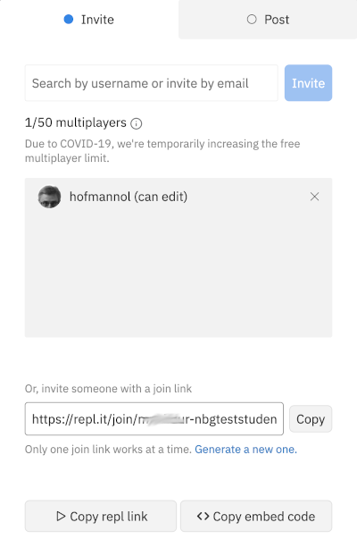

# Software Engineering im Studiengang Media Engineering

## Assignment #2

### Organisatorisches

#### Gruppenassignment
Das zweite Assignment werden Sie nicht mehr als Einzelkämpfer bearbeiten,
sondern im Team. Für Ihr gesamtes Team gibt es damit nur ein
Repository auf GitHub, in das Sie alle Ihre Änderungen 
einbringen können. 

Im Unterschied zum ersten Assignment können Sie sich bei der Annahme
des Assignments entscheiden, ob Sie ein neues Team anlegen oder einem
bestehenden Team beitreten wollen. Neue Teams benötigen auch einen 
Namen, der gut überlegt sein sollte, da er nachher nicht mehr 
geändert werden kann.

Am besten stimmen Sie sich vorher ab, wer in welches Team 
gehen und wie das Team heißen soll.

#### Pair Programming
Das Assignment soll in einer Art *Pair Programming* bearbeitet werden,
d.h. Sie können sich mit Ihrem Team in einer *Breakout-Gruppe* austauschen. 
Darüber hinaus bietet Repl.IT die Möglichkeit, gemeinsam an einem Projekt 
zu arbeiten. Dazu kann eine Person aus dem  Team sein/ihr Repl-Projekt sharen und 
alle anderen Teammitglieder können beitreten. Diese eine Person ist anschließend
der "Fahrer", der die Änderungen im Code vornimmt und das Ergebnis schließlich
in das Repository pusht. Alle anderen können die Änderung mitverfolgen und 
sogar selbst Änderungen eingeben/vorschlagen.

---

Nachdem Sie den Fahrer bestimmt haben, sollte dieser mit dem *Share*-Button
sein Repl freigeben.

Anschließend kann der Fahrer die restlichen Teammitglieder mit Hilfe
eines Einladungslinks, der z.B. im Chat der Breakout-Session
verteilt wird, den Zugang zum freigegeben Repl gewähren. 

Die beigetretenen Teammitglieder arbeiten dann nicht mehr auf 
Ihrer Kopie in Ihrem Repl-Account,
sondern in der Kopie des Fahrers. 
Änderungen werden wechselseitig sofort sichtbar.

### Aufgabenstellung

#### Basisanforderung

Sie finden im zweiten Assignment die vorbereitete Klasse
`TextFormatter`, die lange Texte in einem 
Layout mit fester Spaltenbreite ausgeben soll.
Die zu implementierenden Methoden sind bereits vorgegeben,
es fehlt allerdings Ihre Implementierung:

* Der Konstruktor 
  
  `public TextFormatter(int maxLineLength)`

  soll eine neue Instanz der Klasse anlegen, mit der anschließend 
  die Formatierung auf die übergebene Spaltenbreite durchgeführt 
  werden kann.
  
* Die Instanzmethode

  `public void print(String aText)`
  
  soll den übergebenen Text entsprechend umformatieren. Der
  Zeilenumbruch darf aber immer nur an Leerzeichen erfolgen.
  Ausnahme: Sollte ein Wort länger sein als die vorgegebene 
  Zeilenlänge, so soll dieses Wort beim Erreichen des
  Zeilenendes getrennt werden. 

Versuchen Sie eine Lösung zu finden, die 
die *Clean Code*-Anforderungen möglichst gut erfüllt, d.h. 
* Sprechende Namen
* Kurze Funktionen
* Wenige Funktionsparameter
* ...

Diskutieren Sie Ihre Lösungsansätze im Team.

#### Erweiterung

Erweitern Sie Ihre Lösung so, dass Sie die Zeilen wahlweise
im linksbündigen Flattersatz, im rechtsbündigen Flattersatz 
oder im Blocksatz ausgeben können. 

  

